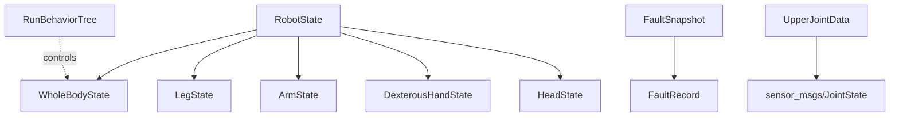

# ROS2 Message Types API Reference

Package: `crb_ros_msg`

This page documents all custom ROS2 message types defined in the `crb_ros_msg` package. These messages are used for robot state reporting, fault management, joystick input, and behavior tree control.

---

## ArmState

Represents the operational state of a single robotic arm.

### Raw Definition

```text
uint8 IDLE = 0
uint8 GRASPING = 1
uint8 PLACING = 2
uint8 CARRYING = 3
uint8 WAVING = 4

uint8 state
```

### Fields

| Field   | Type   | Description           |
|---------|--------|-----------------------|
| `state` | uint8  | Current arm state     |

### Constants

| Name        | Value | Description                |
|-------------|-------|----------------------------|
| `IDLE`      | 0     | Arm is idle                |
| `GRASPING`  | 1     | Arm is grasping an object  |
| `PLACING`   | 2     | Arm is placing an object   |
| `CARRYING`  | 3     | Arm is carrying an object  |
| `WAVING`    | 4     | Arm is waving              |

---

## DexterousHandState

Represents the operational state of a dexterous hand end-effector.

### Raw Definition

```text
uint8 OPEN = 0
uint8 CLOSE = 1
uint8 FINE_MANIPULATION = 2
uint8 HOLDING = 3
uint8 ADJUSTING = 4

uint8 state
```

### Fields

| Field   | Type   | Description                    |
|---------|--------|--------------------------------|
| `state` | uint8  | Current dexterous hand state   |

### Constants

| Name                | Value | Description                        |
|---------------------|-------|------------------------------------|
| `OPEN`              | 0     | Hand is open                       |
| `CLOSE`             | 1     | Hand is closed                     |
| `FINE_MANIPULATION` | 2     | Hand is performing fine manipulation |
| `HOLDING`           | 3     | Hand is holding an object          |
| `ADJUSTING`         | 4     | Hand is adjusting grip             |

---

## FaultRecord

Records a single fault event with metadata about when and where it occurred. Contains typed fields for structured fault data.

### Raw Definition

```text
int64 id
string module_name
string hardware_id
uint8 level
string error_code
string time_occur
string time_recover
uint8 value
string desc
uint8 count
string policy
uint8 snapshot_id
```

### Fields

| Field          | Type    | Description                                         |
|----------------|---------|-----------------------------------------------------|
| `id`           | int64   | Unique fault record identifier                      |
| `module_name`  | string  | Name of the module where the fault occurred         |
| `hardware_id`  | string  | Identifier of the hardware component                |
| `level`        | uint8   | Severity level of the fault                         |
| `error_code`   | string  | Error code associated with the fault                |
| `time_occur`   | string  | Timestamp when the fault occurred                   |
| `time_recover` | string  | Timestamp when the fault was recovered              |
| `value`        | uint8   | Fault value / metric                                |
| `desc`         | string  | Human-readable description of the fault             |
| `count`        | uint8   | Number of times this fault has occurred              |
| `policy`       | string  | Recovery or handling policy applied                 |
| `snapshot_id`  | uint8   | Reference to a FaultSnapshot record                 |

---

## FaultSnapshot

Captures a snapshot of system electrical and thermal state at the time a fault occurs.

### Raw Definition

```text
string id
string voltage
string current
string soc
string temperature
```

### Fields

| Field         | Type   | Description                          |
|---------------|--------|--------------------------------------|
| `id`          | string | Unique snapshot identifier           |
| `voltage`     | string | System voltage at fault time         |
| `current`     | string | System current at fault time         |
| `soc`         | string | State of charge at fault time        |
| `temperature` | string | System temperature at fault time     |

---

## HeadState

Represents the operational state of the robot's head / neck actuator.

### Raw Definition

```text
uint8 OBSERVING = 0
uint8 SCANNING = 1
uint8 TRACKING = 2
uint8 NODDING = 3
uint8 SHAKING = 4

uint8 state
```

### Fields

| Field   | Type   | Description           |
|---------|--------|-----------------------|
| `state` | uint8  | Current head state    |

### Constants

| Name        | Value | Description                  |
|-------------|-------|------------------------------|
| `OBSERVING` | 0     | Head is observing            |
| `SCANNING`  | 1     | Head is scanning the environment |
| `TRACKING`  | 2     | Head is tracking a target    |
| `NODDING`   | 3     | Head is nodding              |
| `SHAKING`   | 4     | Head is shaking              |

---

## HlArmState

High-level arm state message. Identical structure to `ArmState` -- represents the high-level operational state of a robotic arm.

### Raw Definition

```text
uint8 IDLE = 0
uint8 GRASPING = 1
uint8 PLACING = 2
uint8 CARRYING = 3
uint8 WAVING = 4

uint8 state
```

### Fields

| Field   | Type   | Description                |
|---------|--------|----------------------------|
| `state` | uint8  | Current high-level arm state |

### Constants

| Name        | Value | Description                |
|-------------|-------|----------------------------|
| `IDLE`      | 0     | Arm is idle                |
| `GRASPING`  | 1     | Arm is grasping an object  |
| `PLACING`   | 2     | Arm is placing an object   |
| `CARRYING`  | 3     | Arm is carrying an object  |
| `WAVING`    | 4     | Arm is waving              |

---

## JoystickCmdReport

Reports joystick / gamepad input events. Published on topic `joystick_events` with QoS depth 10 at a default frequency of 20 Hz.

### Button Mapping Reference

| Button | ID | Note                    |
|--------|----|-------------------------|
| A      | 0  |                         |
| B      | 1  |                         |
| X      | 2  |                         |
| Y      | 3  |                         |
| LB     | 4  | Left bumper             |
| RB     | 5  | Right bumper            |
| BACK   | 6  |                         |
| START  | 7  |                         |
| LEFT_AXIS  | 9  | Left stick press    |
| RIGHT_AXIS | 10 | Right stick press   |
| LT     | 11 | Left trigger            |
| RT     | 12 | Right trigger           |

### Raw Definition

```text
# 按钮事件数组（存储被操作的按钮ID）
uint32[] long_pressed    # 长按按钮集合
uint32[] single_clicked  # 单击按钮集合
uint32[] double_clicked  # 双击按钮集合

#十字按钮数据
int8 axis_x
int8 axis_y

# 摇杆数据（归一化到[-1.0, 1.0]）
float32 left_x
float32 left_y
float32 right_x
float32 right_y

# 当前按下的按钮ID（实时状态）
uint32[] pressed_buttons  # 所有处于按下状态的按钮
```

### Fields

| Field             | Type       | Description                                              |
|-------------------|------------|----------------------------------------------------------|
| `long_pressed`    | uint32[]   | Array of button IDs that are currently long-pressed      |
| `single_clicked`  | uint32[]   | Array of button IDs that were single-clicked             |
| `double_clicked`  | uint32[]   | Array of button IDs that were double-clicked             |
| `axis_x`          | int8       | D-pad / cross-button horizontal axis value               |
| `axis_y`          | int8       | D-pad / cross-button vertical axis value                 |
| `left_x`          | float32    | Left stick X-axis, normalized to [-1.0, 1.0]            |
| `left_y`          | float32    | Left stick Y-axis, normalized to [-1.0, 1.0]            |
| `right_x`         | float32    | Right stick X-axis, normalized to [-1.0, 1.0]           |
| `right_y`         | float32    | Right stick Y-axis, normalized to [-1.0, 1.0]           |
| `pressed_buttons` | uint32[]   | Array of all button IDs currently held down              |

!!! note
    Left stick data output does not increment linearly with stick displacement.

---

## LegState

Represents the operational state of the robot's leg locomotion system.

### Raw Definition

```text
uint8 STANDING = 0
uint8 WALKING = 1
uint8 RUNNING = 2
uint8 BALANCING = 3
uint8 JUMPING = 4

uint8 state
```

### Fields

| Field   | Type   | Description           |
|---------|--------|-----------------------|
| `state` | uint8  | Current leg state     |

### Constants

| Name        | Value | Description                  |
|-------------|-------|------------------------------|
| `STANDING`  | 0     | Robot is standing            |
| `WALKING`   | 1     | Robot is walking             |
| `RUNNING`   | 2     | Robot is running             |
| `BALANCING` | 3     | Robot is balancing           |
| `JUMPING`   | 4     | Robot is jumping             |

---

## NodeStatus

Represents the execution status of a behavior tree node.

### Raw Definition

```text
uint8 IDLE = 0
uint8 RUNNING = 1
uint8 SUCCESS = 2
uint8 FAILURE = 3
uint8 SKIPPED = 4

uint8 status
```

### Fields

| Field    | Type   | Description                |
|----------|--------|----------------------------|
| `status` | uint8  | Current node status        |

### Constants

| Name      | Value | Description                      |
|-----------|-------|----------------------------------|
| `IDLE`    | 0     | Node has not started execution   |
| `RUNNING` | 1     | Node is currently executing      |
| `SUCCESS` | 2     | Node completed successfully      |
| `FAILURE` | 3     | Node completed with failure      |
| `SKIPPED` | 4     | Node was skipped                 |

---

## RobotState

Aggregates all major subsystem states into a single composite message. This is the top-level state reporting message.

### Raw Definition

```text
WholeBodyState whole_body_state
LegState leg_state
ArmState arm_state
DexterousHandState dexterous_hand_state
HeadState head_state
```

### Fields

| Field                  | Type                | Description                       |
|------------------------|---------------------|-----------------------------------|
| `whole_body_state`     | WholeBodyState      | Overall body state                |
| `leg_state`            | LegState            | Leg locomotion state              |
| `arm_state`            | ArmState            | Arm operational state             |
| `dexterous_hand_state` | DexterousHandState  | Dexterous hand state              |
| `head_state`           | HeadState           | Head / neck actuator state        |

---

## RunBehaviorTree

Command message to start or cancel a named behavior tree.

### Raw Definition

```text
string behavior_tree_name
int cmd  #1：start，2：cancel
```

### Fields

| Field                | Type   | Description                                   |
|----------------------|--------|-----------------------------------------------|
| `behavior_tree_name` | string | Name of the behavior tree to control          |
| `cmd`                | int    | Command: `1` = start, `2` = cancel            |

---

## UpperJointData

Carries upper-body joint state data with a timestamp and velocity scale factor.

### Raw Definition

```text
std_msgs/Header header
float32 time_ref
float32 vel_scale
sensor_msgs/JointState joint
```

### Fields

| Field       | Type                    | Description                                 |
|-------------|-------------------------|---------------------------------------------|
| `header`    | std_msgs/Header         | Standard ROS2 header with timestamp and frame |
| `time_ref`  | float32                 | Reference timestamp for the joint data      |
| `vel_scale` | float32                 | Velocity scale factor                       |
| `joint`     | sensor_msgs/JointState  | Full joint state (positions, velocities, efforts) |

---

## WholeBodyState

Represents the high-level operational state of the entire robot body.

### Raw Definition

```text
uint8 IDLE = 0
uint8 INITIALIZE = 1
uint8 TASK_EXECUTION = 2
uint8 FAULT = 3
uint8 EMERGENCY_STOP = 4

uint8 state
```

### Fields

| Field   | Type   | Description                |
|---------|--------|----------------------------|
| `state` | uint8  | Current whole-body state   |

### Constants

| Name              | Value | Description                      |
|-------------------|-------|----------------------------------|
| `IDLE`            | 0     | Robot is idle                    |
| `INITIALIZE`      | 1     | Robot is initializing            |
| `TASK_EXECUTION`  | 2     | Robot is executing a task        |
| `FAULT`           | 3     | Robot is in a fault state        |
| `EMERGENCY_STOP`  | 4     | Emergency stop has been triggered |

---

## Message Dependency Graph

The `RobotState` message composes all major subsystem messages:


