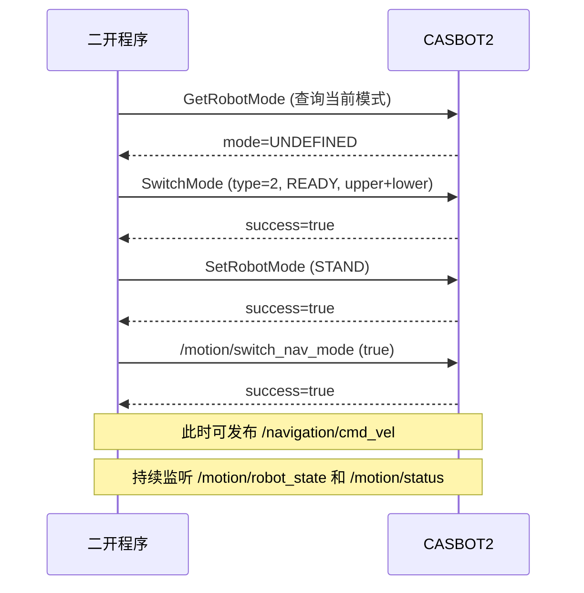

# 模式与状态

CASBOT2 运动控制器支持多种运行模式。本节介绍如何查询、切换模式，以及如何监听机器人状态。

## 查询当前模式 -- GetRobotMode

`GetRobotMode` 是一个无参 Service，返回当前模式的数值标识和名称。

=== "Python"

    ```python
    import rclpy
    from rclpy.node import Node
    from crb_ros_msg.srv import GetRobotMode


    class ModeQueryNode(Node):
        def __init__(self):
            super().__init__('mode_query_node')
            self.cli = self.create_client(GetRobotMode, 'get_robot_mode')
            self.cli.wait_for_service()

        def query(self):
            future = self.cli.call_async(GetRobotMode.Request())
            rclpy.spin_until_future_complete(self, future)
            result = future.result()
            self.get_logger().info(
                f'当前模式: {result.mode_name} (id={result.mode})'
            )
            return result


    def main():
        rclpy.init()
        node = ModeQueryNode()
        node.query()
        node.destroy_node()
        rclpy.shutdown()


    if __name__ == '__main__':
        main()
    ```

=== "C++"

    ```cpp
    #include <rclcpp/rclcpp.hpp>
    #include <crb_ros_msg/srv/get_robot_mode.hpp>

    #include <chrono>

    using namespace std::chrono_literals;

    int main(int argc, char ** argv)
    {
      rclcpp::init(argc, argv);
      auto node = rclcpp::Node::make_shared("mode_query_node");
      auto client =
        node->create_client<crb_ros_msg::srv::GetRobotMode>("get_robot_mode");

      if (!client->wait_for_service(5s)) {
        RCLCPP_ERROR(node->get_logger(), "Service not available");
        return 1;
      }

      auto request = std::make_shared<crb_ros_msg::srv::GetRobotMode::Request>();
      auto future = client->async_send_request(request);

      if (rclcpp::spin_until_future_complete(node, future) ==
          rclcpp::FutureReturnCode::SUCCESS)
      {
        auto result = future.get();
        RCLCPP_INFO(
          node->get_logger(), "当前模式: %s (id=%d)",
          result->mode_name.c_str(), result->mode);
      }

      rclcpp::shutdown();
      return 0;
    }
    ```

## 设置模式 -- SetRobotMode

`SetRobotMode` 通过名称直接切换到目标模式。

**支持的模式名称**

| mode_name | 说明 |
|-----------|------|
| `ZERO` | 零位模式 |
| `STAND` | 站立模式 |
| `WALK` | 行走模式 |
| `TREAD` | 原地踏步模式 |

=== "Python"

    ```python
    import rclpy
    from rclpy.node import Node
    from crb_ros_msg.srv import SetRobotMode


    class ModeSetNode(Node):
        def __init__(self):
            super().__init__('mode_set_node')
            self.cli = self.create_client(SetRobotMode, '/set_robot_mode')
            self.cli.wait_for_service()

        def set_mode(self, mode_name: str):
            req = SetRobotMode.Request()
            req.mode_name = mode_name
            future = self.cli.call_async(req)
            rclpy.spin_until_future_complete(self, future)
            ok = future.result().success
            self.get_logger().info(
                f'切换到 {mode_name}: {"成功" if ok else "失败"}'
            )
            return ok


    def main():
        rclpy.init()
        node = ModeSetNode()
        node.set_mode('STAND')
        node.destroy_node()
        rclpy.shutdown()


    if __name__ == '__main__':
        main()
    ```

=== "C++"

    ```cpp
    #include <rclcpp/rclcpp.hpp>
    #include <crb_ros_msg/srv/set_robot_mode.hpp>

    #include <chrono>
    #include <string>

    using namespace std::chrono_literals;

    int main(int argc, char ** argv)
    {
      rclcpp::init(argc, argv);
      auto node = rclcpp::Node::make_shared("mode_set_node");
      auto client =
        node->create_client<crb_ros_msg::srv::SetRobotMode>("/set_robot_mode");

      if (!client->wait_for_service(5s)) {
        RCLCPP_ERROR(node->get_logger(), "Service not available");
        return 1;
      }

      auto request = std::make_shared<crb_ros_msg::srv::SetRobotMode::Request>();
      request->mode_name = "STAND";
      auto future = client->async_send_request(request);

      if (rclcpp::spin_until_future_complete(node, future) ==
          rclcpp::FutureReturnCode::SUCCESS)
      {
        RCLCPP_INFO(
          node->get_logger(), "切换到 STAND: %s",
          future.get()->success ? "成功" : "失败");
      }

      rclcpp::shutdown();
      return 0;
    }
    ```

## 精细模式切换 -- SwitchMode

当需要分别控制上半身和下半身，或指定更底层的模式类型时，使用 `SwitchMode` 服务。

**模式类型枚举**

| mode_type | 名称 | 说明 |
|-----------|------|------|
| 0 | `UNDEFINED` | 未定义 / 默认 |
| 1 | `DAMPING` | 阻尼模式 |
| 2 | `READY` | 就绪模式 |
| 3 | `SPORT` | 运动模式 |
| 4 | `ACTION_PLAY` | 动作回放 |
| 5 | `TELEOPERATION` | 遥操作 |
| 6 | `DEBUG` | 调试模式 |

=== "Python"

    ```python
    import rclpy
    from rclpy.node import Node
    from crb_ros_msg.srv import SwitchMode


    class SwitchModeNode(Node):
        def __init__(self):
            super().__init__('switch_mode_node')
            self.cli = self.create_client(SwitchMode, '/switch_mode')
            self.cli.wait_for_service()

        def switch(self, mode_type: int, mode_name: str,
                   upper_body: bool = True, lower_body: bool = True):
            req = SwitchMode.Request()
            req.mode_type = mode_type
            req.mode_name = mode_name
            req.upper_body = upper_body
            req.lower_body = lower_body
            future = self.cli.call_async(req)
            rclpy.spin_until_future_complete(self, future)
            res = future.result()
            self.get_logger().info(
                f'切换到 {mode_name} (type={mode_type}): '
                f'{"成功" if res.success else "失败"} - {res.message}'
            )
            return res.success


    def main():
        rclpy.init()
        node = SwitchModeNode()

        # 进入就绪模式，上半身和下半身都参与
        node.switch(mode_type=2, mode_name='READY',
                    upper_body=True, lower_body=True)

        # 仅对下半身切换到运动模式
        node.switch(mode_type=3, mode_name='SPORT',
                    upper_body=False, lower_body=True)

        node.destroy_node()
        rclpy.shutdown()


    if __name__ == '__main__':
        main()
    ```

=== "C++"

    ```cpp
    #include <rclcpp/rclcpp.hpp>
    #include <crb_ros_msg/srv/switch_mode.hpp>

    #include <chrono>
    #include <string>

    using namespace std::chrono_literals;

    int main(int argc, char ** argv)
    {
      rclcpp::init(argc, argv);
      auto node = rclcpp::Node::make_shared("switch_mode_node");
      auto client =
        node->create_client<crb_ros_msg::srv::SwitchMode>("/switch_mode");

      if (!client->wait_for_service(5s)) {
        RCLCPP_ERROR(node->get_logger(), "Service not available");
        return 1;
      }

      // 进入就绪模式
      auto request = std::make_shared<crb_ros_msg::srv::SwitchMode::Request>();
      request->mode_type = 2;        // READY
      request->mode_name = "READY";
      request->upper_body = true;
      request->lower_body = true;

      auto future = client->async_send_request(request);

      if (rclcpp::spin_until_future_complete(node, future) ==
          rclcpp::FutureReturnCode::SUCCESS)
      {
        auto res = future.get();
        RCLCPP_INFO(
          node->get_logger(), "切换到 READY: %s - %s",
          res->success ? "成功" : "失败",
          res->message.c_str());
      }

      rclcpp::shutdown();
      return 0;
    }
    ```

## 导航模式开关

通过 `/motion/switch_nav_mode` 服务启用或关闭导航模式。该服务使用标准 `std_srvs/SetBool`：

- `data: true` -- 启用导航模式
- `data: false` -- 关闭导航模式

=== "Python"

    ```python
    import rclpy
    from rclpy.node import Node
    from std_srvs.srv import SetBool


    class NavModeNode(Node):
        def __init__(self):
            super().__init__('nav_mode_node')
            self.cli = self.create_client(SetBool, '/motion/switch_nav_mode')
            self.cli.wait_for_service()

        def enable(self, on: bool):
            req = SetBool.Request()
            req.data = on
            future = self.cli.call_async(req)
            rclpy.spin_until_future_complete(self, future)
            res = future.result()
            action = '启用' if on else '关闭'
            self.get_logger().info(
                f'导航模式 {action}: {"成功" if res.success else "失败"} - {res.message}'
            )


    def main():
        rclpy.init()
        node = NavModeNode()
        node.enable(True)
        node.destroy_node()
        rclpy.shutdown()


    if __name__ == '__main__':
        main()
    ```

=== "C++"

    ```cpp
    #include <rclcpp/rclcpp.hpp>
    #include <std_srvs/srv/set_bool.hpp>

    #include <chrono>

    using namespace std::chrono_literals;

    int main(int argc, char ** argv)
    {
      rclcpp::init(argc, argv);
      auto node = rclcpp::Node::make_shared("nav_mode_node");
      auto client =
        node->create_client<std_srvs::srv::SetBool>("/motion/switch_nav_mode");

      if (!client->wait_for_service(5s)) {
        RCLCPP_ERROR(node->get_logger(), "Service not available");
        return 1;
      }

      auto request = std::make_shared<std_srvs::srv::SetBool::Request>();
      request->data = true;  // 启用导航模式
      auto future = client->async_send_request(request);

      if (rclcpp::spin_until_future_complete(node, future) ==
          rclcpp::FutureReturnCode::SUCCESS)
      {
        auto res = future.get();
        RCLCPP_INFO(
          node->get_logger(), "导航模式启用: %s - %s",
          res->success ? "成功" : "失败",
          res->message.c_str());
      }

      rclcpp::shutdown();
      return 0;
    }
    ```

## 遥操作开关

通过 `/switch_teleoperation` 服务启用或关闭遥操作模式，接口同样为 `std_srvs/SetBool`。

=== "Python"

    ```python
    import rclpy
    from rclpy.node import Node
    from std_srvs.srv import SetBool


    class TeleoperationNode(Node):
        def __init__(self):
            super().__init__('teleoperation_node')
            self.cli = self.create_client(SetBool, '/switch_teleoperation')
            self.cli.wait_for_service()

        def enable(self, on: bool):
            req = SetBool.Request()
            req.data = on
            future = self.cli.call_async(req)
            rclpy.spin_until_future_complete(self, future)
            res = future.result()
            action = '启用' if on else '关闭'
            self.get_logger().info(
                f'遥操作模式 {action}: {"成功" if res.success else "失败"} - {res.message}'
            )


    def main():
        rclpy.init()
        node = TeleoperationNode()
        node.enable(True)
        node.destroy_node()
        rclpy.shutdown()


    if __name__ == '__main__':
        main()
    ```

=== "C++"

    ```cpp
    #include <rclcpp/rclcpp.hpp>
    #include <std_srvs/srv/set_bool.hpp>

    #include <chrono>

    using namespace std::chrono_literals;

    int main(int argc, char ** argv)
    {
      rclcpp::init(argc, argv);
      auto node = rclcpp::Node::make_shared("teleoperation_node");
      auto client =
        node->create_client<std_srvs::srv::SetBool>("/switch_teleoperation");

      if (!client->wait_for_service(5s)) {
        RCLCPP_ERROR(node->get_logger(), "Service not available");
        return 1;
      }

      auto request = std::make_shared<std_srvs::srv::SetBool::Request>();
      request->data = true;  // 启用遥操作
      auto future = client->async_send_request(request);

      if (rclcpp::spin_until_future_complete(node, future) ==
          rclcpp::FutureReturnCode::SUCCESS)
      {
        auto res = future.get();
        RCLCPP_INFO(
          node->get_logger(), "遥操作模式启用: %s - %s",
          res->success ? "成功" : "失败",
          res->message.c_str());
      }

      rclcpp::shutdown();
      return 0;
    }
    ```

## 自主模式开关

通过 `/switch_autonomous` 服务启用或关闭自主运行模式，接口同样为 `std_srvs/SetBool`。

=== "Python"

    ```python
    import rclpy
    from rclpy.node import Node
    from std_srvs.srv import SetBool


    class AutonomousNode(Node):
        def __init__(self):
            super().__init__('autonomous_node')
            self.cli = self.create_client(SetBool, '/switch_autonomous')
            self.cli.wait_for_service()

        def enable(self, on: bool):
            req = SetBool.Request()
            req.data = on
            future = self.cli.call_async(req)
            rclpy.spin_until_future_complete(self, future)
            res = future.result()
            action = '启用' if on else '关闭'
            self.get_logger().info(
                f'自主模式 {action}: {"成功" if res.success else "失败"} - {res.message}'
            )


    def main():
        rclpy.init()
        node = AutonomousNode()
        node.enable(True)
        node.destroy_node()
        rclpy.shutdown()


    if __name__ == '__main__':
        main()
    ```

=== "C++"

    ```cpp
    #include <rclcpp/rclcpp.hpp>
    #include <std_srvs/srv/set_bool.hpp>

    #include <chrono>

    using namespace std::chrono_literals;

    int main(int argc, char ** argv)
    {
      rclcpp::init(argc, argv);
      auto node = rclcpp::Node::make_shared("autonomous_node");
      auto client =
        node->create_client<std_srvs::srv::SetBool>("/switch_autonomous");

      if (!client->wait_for_service(5s)) {
        RCLCPP_ERROR(node->get_logger(), "Service not available");
        return 1;
      }

      auto request = std::make_shared<std_srvs::srv::SetBool::Request>();
      request->data = true;  // 启用自主模式
      auto future = client->async_send_request(request);

      if (rclcpp::spin_until_future_complete(node, future) ==
          rclcpp::FutureReturnCode::SUCCESS)
      {
        auto res = future.get();
        RCLCPP_INFO(
          node->get_logger(), "自主模式启用: %s - %s",
          res->success ? "成功" : "失败",
          res->message.c_str());
      }

      rclcpp::shutdown();
      return 0;
    }
    ```

## 机器人状态监控

CASBOT2 通过两个 Topic 向外发布运行状态信息：

| Topic | 类型 | 说明 |
|-------|------|------|
| `/motion/robot_state` | `std_msgs/String` | 机器人综合状态（JSON 字符串） |
| `/motion/status` | `std_msgs/String` | 运动控制器状态（JSON 字符串） |

两个话题均以 JSON 字符串形式发布，开发者需要自行解析。

### 监听 robot_state

`/motion/robot_state` 会持续推送机器人全局状态，适合用于状态面板或异常检测。

=== "Python"

    ```python
    import json

    import rclpy
    from rclpy.node import Node
    from std_msgs.msg import String


    class RobotStateMonitor(Node):
        def __init__(self):
            super().__init__('robot_state_monitor')
            self.sub = self.create_subscription(
                String, '/motion/robot_state', self.on_state, 10)

        def on_state(self, msg: String):
            try:
                data = json.loads(msg.data)
                self.get_logger().info(f'robot_state: {json.dumps(data, ensure_ascii=False)}')
            except json.JSONDecodeError:
                self.get_logger().warn(f'无法解析 robot_state: {msg.data}')


    def main():
        rclpy.init()
        node = RobotStateMonitor()
        rclpy.spin(node)
        node.destroy_node()
        rclpy.shutdown()


    if __name__ == '__main__':
        main()
    ```

=== "C++"

    ```cpp
    #include <rclcpp/rclcpp.hpp>
    #include <std_msgs/msg/string.hpp>

    class RobotStateMonitor : public rclcpp::Node
    {
    public:
      RobotStateMonitor()
      : Node("robot_state_monitor")
      {
        sub_ = create_subscription<std_msgs::msg::String>(
          "/motion/robot_state", 10,
          [this](const std_msgs::msg::String::SharedPtr msg) {
            RCLCPP_INFO(get_logger(), "robot_state: %s", msg->data.c_str());
          });
      }

    private:
      rclcpp::Subscription<std_msgs::msg::String>::SharedPtr sub_;
    };

    int main(int argc, char ** argv)
    {
      rclcpp::init(argc, argv);
      rclcpp::spin(std::make_shared<RobotStateMonitor>());
      rclcpp::shutdown();
      return 0;
    }
    ```

### 监听 motion/status

`/motion/status` 用于监控运动控制器的实时状态，适合在运动控制流程中做前置检查。

=== "Python"

    ```python
    import json

    import rclpy
    from rclpy.node import Node
    from std_msgs.msg import String


    class MotionStatusMonitor(Node):
        def __init__(self):
            super().__init__('motion_status_monitor')
            self.sub = self.create_subscription(
                String, '/motion/status', self.on_status, 10)

        def on_status(self, msg: String):
            try:
                data = json.loads(msg.data)
                self.get_logger().info(f'motion status: {json.dumps(data, ensure_ascii=False)}')
            except json.JSONDecodeError:
                self.get_logger().warn(f'无法解析 motion status: {msg.data}')


    def main():
        rclpy.init()
        node = MotionStatusMonitor()
        rclpy.spin(node)
        node.destroy_node()
        rclpy.shutdown()


    if __name__ == '__main__':
        main()
    ```

=== "C++"

    ```cpp
    #include <rclcpp/rclcpp.hpp>
    #include <std_msgs/msg/string.hpp>

    class MotionStatusMonitor : public rclcpp::Node
    {
    public:
      MotionStatusMonitor()
      : Node("motion_status_monitor")
      {
        sub_ = create_subscription<std_msgs::msg::String>(
          "/motion/status", 10,
          [this](const std_msgs::msg::String::SharedPtr msg) {
            RCLCPP_INFO(get_logger(), "motion status: %s", msg->data.c_str());
          });
      }

    private:
      rclcpp::Subscription<std_msgs::msg::String>::SharedPtr sub_;
    };

    int main(int argc, char ** argv)
    {
      rclcpp::init(argc, argv);
      rclcpp::spin(std::make_shared<MotionStatusMonitor>());
      rclcpp::shutdown();
      return 0;
    }
    ```

## 典型模式切换流程



!!! warning "切换顺序"
    建议按照 `SwitchMode -> SetRobotMode -> 功能开关` 的顺序操作。在未进入目标基础模式前，不要启用导航、遥操作或自主模式。
