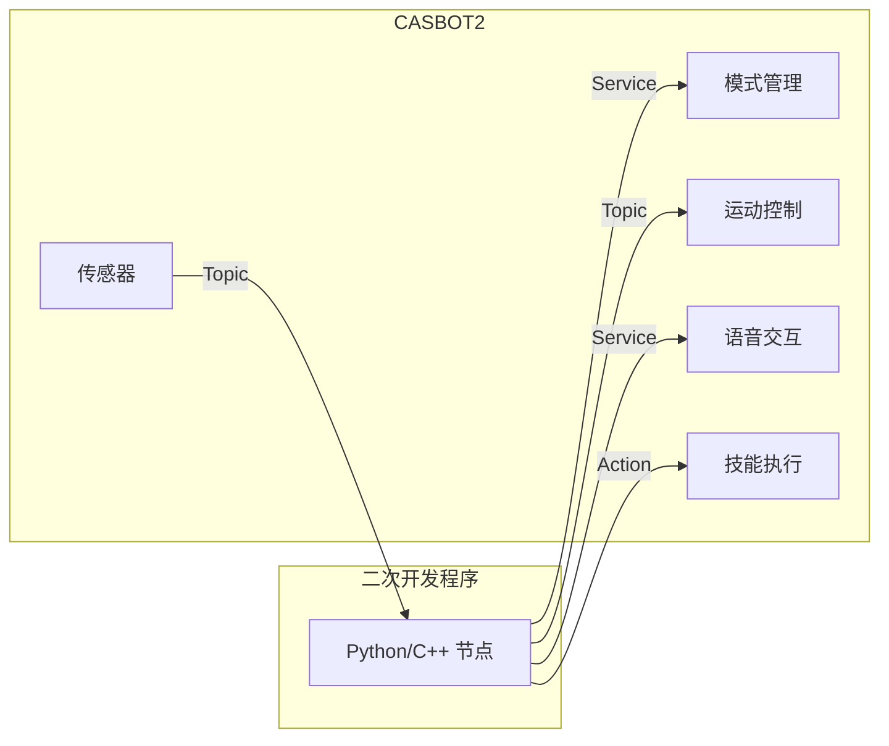

# 接口总览

CASBOT2 通过 ROS 2 的 Topic / Service / Action 三种通讯方式与二次开发程序交互。

## 通讯架构

## 服务接口 (Service)

| 名称 | 类型 | 说明 |
|---|---|---|
| get_robot_mode | GetRobotMode | 查询当前模式 |
| /set_robot_mode | SetRobotMode | 设置模式 (ZERO/STAND/WALK/TREAD) |
| /motion/upper_body_debug | SetBool | 上身调试模式开关 |
| /motion/whole_body_debug | SetBool | 全身调试模式开关 |
| /motion/switch_nav_mode | SetBool | 导航模式开关 |
| /switch_teleoperation | SetBool | 遥操作模式开关 |
| /switch_autonomous | SetBool | 自主模式开关 |
| /voice_svr | Voice | 语音对话 |
| /casbot/event_service | ActionEvent | 技能/事件触发 |

## 话题接口 (Topic)

| 名称 | 类型 | 方向 | 说明 |
|---|---|---|---|
| /navigation/cmd_vel | Twist | 开发者 -> 机器人 | 行走速度控制 |
| /upper_body_debug/joint_cmd | UpperJointData | 开发者 -> 机器人 | 上身关节控制 |
| /motion/joint_cmd | JointStateData | 开发者 -> 机器人 | 全身关节控制 |
| /motion/joint_state | JointStateData | 机器人 -> 开发者 | 全身关节状态反馈 |
| /joint_states | JointState | 机器人 -> 开发者 | 标准关节状态 |
| /joint_control | JointState | 机器人 -> 开发者 | 关节控制反馈 |
| /motion/status | String | 机器人 -> 开发者 | 运控状态 |
| /motion/robot_state | String | 机器人 -> 开发者 | 机器人状态 |
| /imu | Imu | 机器人 -> 开发者 | IMU 数据 |

## 动作接口 (Action)

| 名称 | 类型 | 说明 |
|---|---|---|
| /basic_action_play | BasicActionPlay | 预设动作播放 (挥手/点赞/比心等) |
| /action_voice_play | VoicePlay | 音频文件播放 |

## 建议流程

1. 上电后先确认模式状态
2. 进入对应调试模式再发布控制指令
3. 低速、低增益开始联调
4. 使用 /motion/joint_state 与 /joint_states 双通道观测
