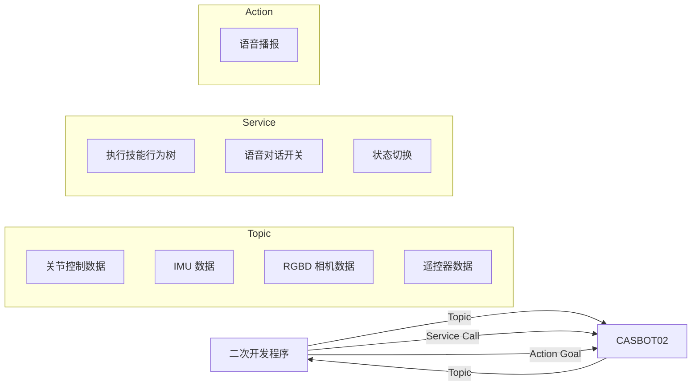

---
hide:
  - navigation
---

# CASBOT02 二次开发文档

**CASBOT02** 是一款身高 160cm、体重 50kg 的通用人形机器人。

基于 **ROS2** 的开放架构，支持 **Python** 和 **C++** 双语言二次开发。

[:material-rocket-launch: 快速开始](getting-started/overview.md){ .md-button .md-button--primary }
[:material-book-open-variant: SDK 接口](sdk/overview.md){ .md-button }

---

## 功能概览

-   :material-robot:{ .lg .middle } **硬件参考**

    ---

    整机结构、传感器感知范围、关节活动角度

    [:octicons-arrow-right-24: 查看详情](hardware/robot-structure.md)

-   :material-api:{ .lg .middle } **SDK 接口**

    ---

    ROS2 Topic / Service / Action 接口文档

    语音对话 · 预设技能 · 传感器数据

    [:octicons-arrow-right-24: 查看详情](sdk/overview.md)

-   :material-motion-outline:{ .lg .middle } **运控开发**

    ---

    行走控制、关节控制、强化学习运控

    支持下肢 / 上身 / 全身三种控制粒度

    [:octicons-arrow-right-24: 查看详情](motion-control/walking.md)

-   :material-cog:{ .lg .middle } **技能定制**

    ---

    自定义动作数据 + 音频播放

    支持动画设计软件 / RViz 生成运动轨迹

    [:octicons-arrow-right-24: 查看详情](sdk/skills/custom-skills.md)

---

## 通信架构

| 通讯方式 | 方向 | 用途 |
|---|---|---|
| **Topic** | CASBOT02 → 开发者 | 关节状态、IMU 数据、RGBD 相机数据 |
| **Topic** | 开发者 → CASBOT02 | 关节控制数据、遥控器数据 |
| **Service** | 开发者 → CASBOT02 | 技能行为树、语音对话开关、状态切换 |
| **Action** | 开发者 → CASBOT02 | 语音播报 |

---

## 依赖包

CASBOT02 的 ROS2 自定义消息包：

| 包名 | 说明 |
|---|---|
| `crb_ros_msg` | 包含所有自定义消息/服务/动作类型 |

<!-- TODO: 补充依赖包的安装方式和下载链接 -->
