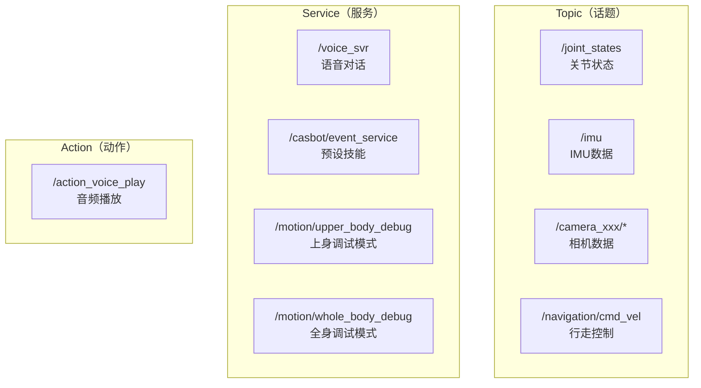

# SDK 总览

CASBOT02 采用 ROS2 的通信机制进行二次开发。SDK 接口形式对应 ROS2 的三种标准通讯模式：**Topic**、**Service**、**Action**。

## 通讯模式一览

## Topic（话题）

用于**持续性数据流**的发布与订阅。

| 方向 | 数据类型 | 说明 |
|---|---|---|
| CASBOT02 → 开发者 | 关节状态、IMU、相机 | 传感器数据流 |
| 开发者 → CASBOT02 | 关节控制、遥控器 | 指令数据流 |

## Service（服务）

用于**一次性请求/响应**操作。

| 服务名 | 类型 | 功能 |
|---|---|---|
| `/voice_svr` | `Voice.srv` | 语音对话开关、提问、回答 |
| `/casbot/event_service` | `ActionEvent.srv` | 执行预设技能/自定义动作 |
| `/motion/upper_body_debug` | `SetBool` | 上身调试模式开关 |
| `/motion/whole_body_debug` | `SetBool` | 全身调试模式开关 |

## Action（动作）

用于**长时间运行、有反馈**的任务。

| 动作名 | 类型 | 功能 |
|---|---|---|
| `/action_voice_play` | `VoicePlay.action` | 播放音频文件 |

## 依赖包

所有自定义消息/服务/动作类型定义在 `crb_ros_msg` 包中：

| 自定义类型 | 用途 |
|---|---|
| `crb_ros_msg/srv/Voice` | 语音对话服务 |
| `crb_ros_msg/srv/ActionEvent` | 技能执行服务 |
| `crb_ros_msg/action/VoicePlay` | 音频播放动作 |
| `crb_ros_msg/msg/UpperJointData` | 上身关节控制消息 |
